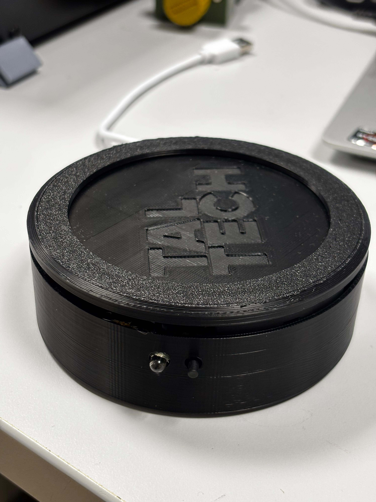
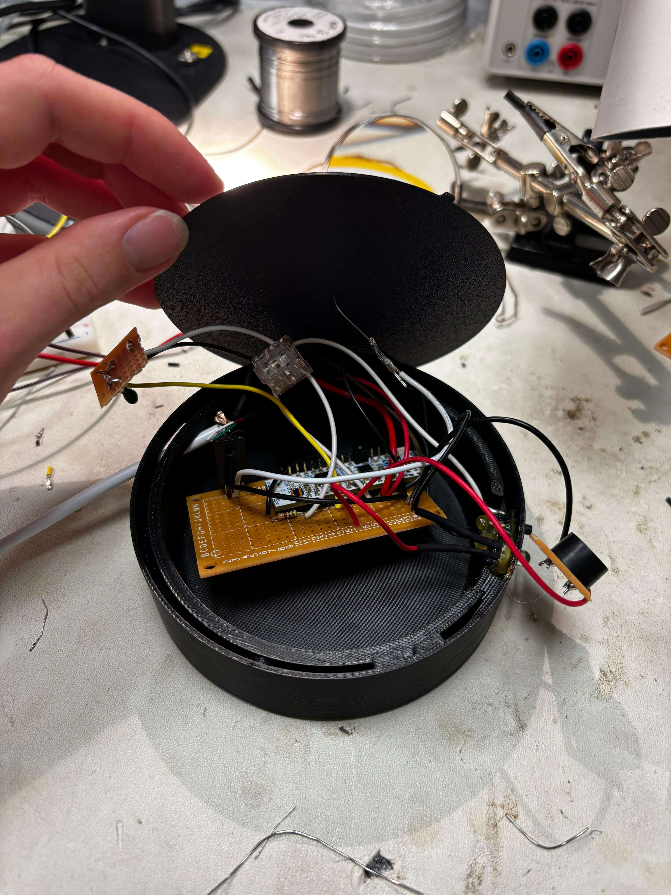
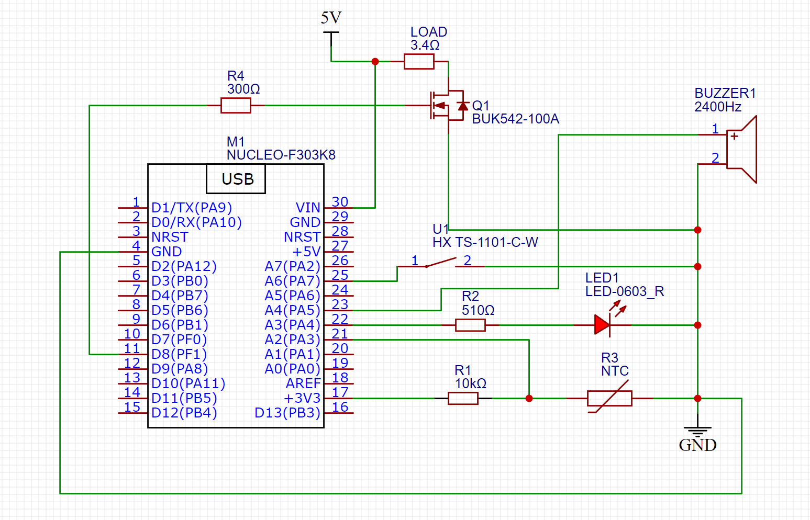

# Mug Heater Project
This project uses the Nucleo STM32-F303K8 microcontroller to create a mug heater device that keeps your drink warm. The device is powered by USB-A.

## Contents Overview
1. [Project Overview](#project-overview)
2. [Device Images](#device-images)
3. [Circuit Diagram](#circuit-diagram)
4. [Connected Components](#connected-components)
5. [System Features](#system-features)
6. [Assembly and Setup](#assembly-and-setup)
7. [3D Printing Files](#3d-printing-files)
8. [Future Improvements](#future-improvements)
9. [Important Considerations](#important-considerations)
10. [License](#license)

## Project Overview
The mug heater is designed to:
- Maintain your drink at a desired temperature (default: 60°C).
- Be simple and portable with USB power.
- Use a combination of an NTC thermistor, a MOSFET, and a buzzer for temperature control and alerts.

## Device Images

## Circuit Diagram

## Connected Components
- **Load switching MOSFET gate** on `PA11`
- **NTC Thermistor** on `PA3`
- **Buzzer** on `PA5` which indicates a reached temperature
- **Button** on `PA7` which turns `off` and `on` the heating
- **LED** on `PA4` which indicates the mode of heating:
  - Flashes and then `on`: Starting heating
  - Flashes and then `off`: Stopping heating

## System Features
- **Temperature Control**: Reads ADC every 10 seconds and adjusts the load based on a specified temperature (default: 60°C).
- **On/Off Button**: Turns heating on or off and toggles an indicator LED.
- **Buzzer Alert**: Plays a sound when the specified temperature is reached.
- **LED Feedback**: Temperature is displayed as blinks (1 blink per 10°C).
- **Debounced Button**: Ensures stable toggling with a 50ms debounce threshold.
- **Failsafe Temperature**: System ignores invalid temperature readings and keeps the load off.

## Assembly and Setup
1. **Required Components**:
   - Nucleo STM32-F303K8 board
   - **MOSFET**: BUK542-100A (for load switching)
   - **10k NTC Thermistor**: R3
   - **Buzzer**: 2400Hz
   - **Button**: HX TS-1101-C-W
   - **LED**: LED-0603_R
   - **Resistors**:
     - R1: 10kΩ (pull-down for NTC thermistor)
     - R2: 510Ω (series resistor for button)
     - R4: 300Ω (current limiting for LED)
     - R5: 510Ω (NRST Short [See Notes](#important-considerations))
   - USB-A power source
   - Load: 3.4Ω heating element

2. **Setup Instructions**:
   - Connect the peripherals as shown in the [Circuit Diagram](#circuit-diagram).
   - Flash the microcontroller with the provided firmware.
   - Assemble the device with proper insulation for the heater.

3. **Programming**:
   - Use PlatformIO with VS Code for flashing the microcontroller.

4. **Testing**:
   - Verify temperature control functionality.
   - Test the buzzer, button, and LED indicators.

## 3D Printing Files
The following files are included for 3D printing the device components:
- `3d_print/02_Wire_Plate.SLDPRT`
- `3d_print/03_Base.SLDPRT`
- `3d_print/04_Top_Base.SLDPRT`
- `3d_print/05_Aluminum_Plate.SLDPRT`

These files can be used to fabricate the structural parts of the mug heater.

## Future Improvements
1. Plastic casing does not lock in place. It needs larger gap around locking mechanism.
2. Custom PCB
3. PID heating control
4. Custom buzzer sounds - like Star Wars Imperial March etc. 
5. Automatic shutdown

## Important Considerations
- A **510-ohm short** from `NRST` to `3.3V` is required to power the device with a single cable. This bypasses the issue where the ST-LINK pulls down the `NRST` pin, causing the microcontroller to remain in reset when ST-LINK is disconnected.
- Ensure proper insulation for the heating element to prevent accidental burns or short circuits.

## License
This project is open-source under the [Apache License](LICENSE). Feel free to use and modify it!
